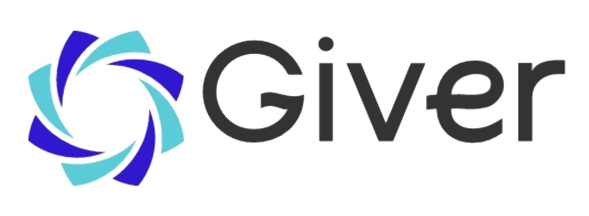
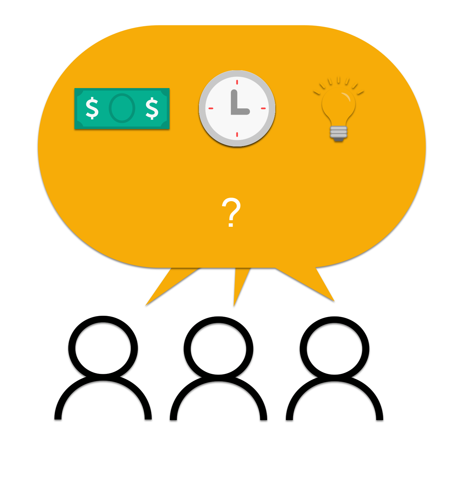
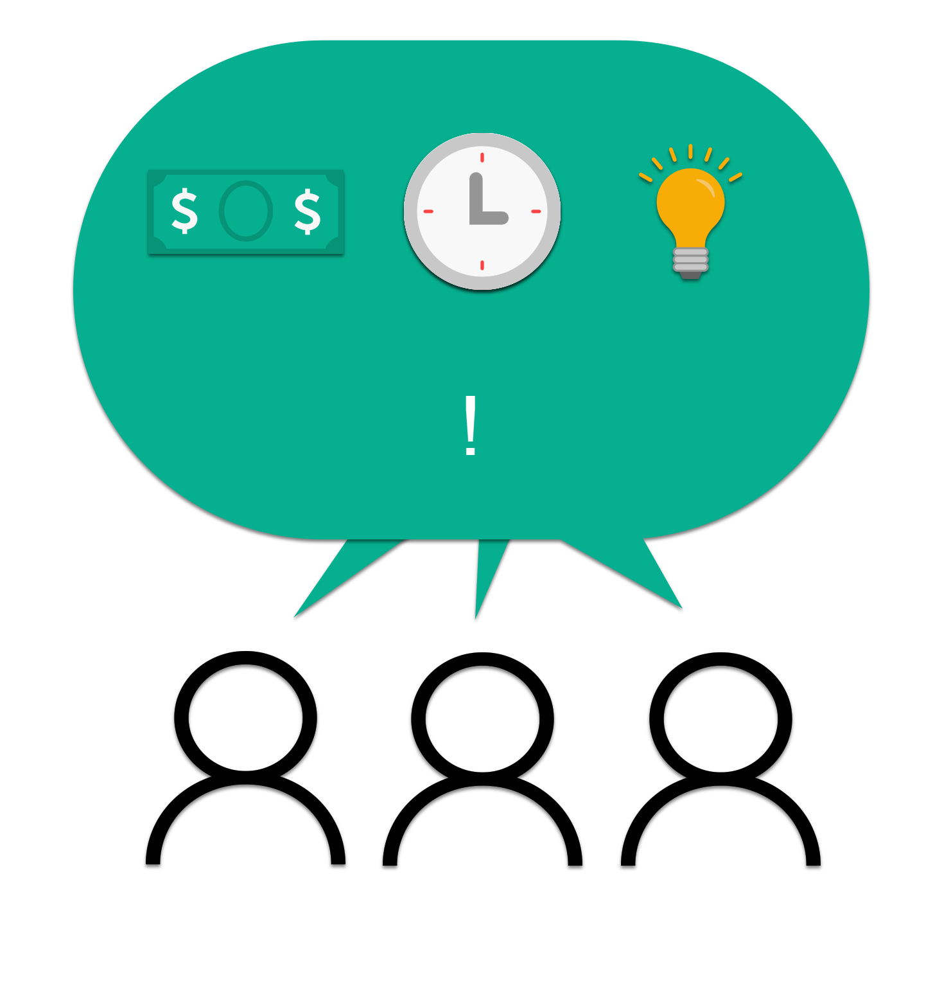
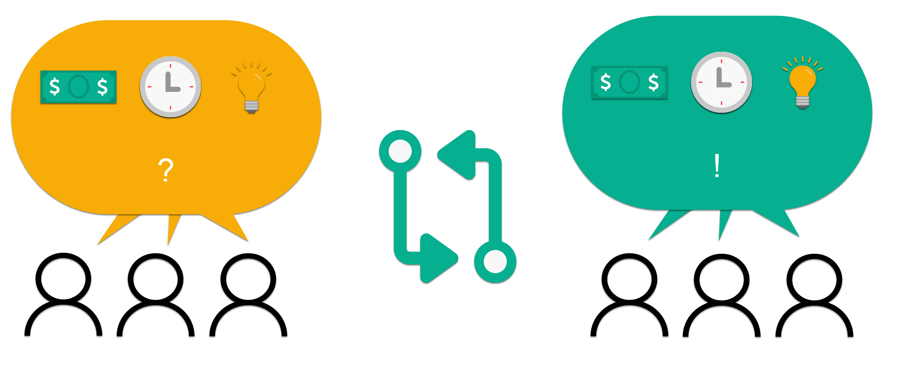
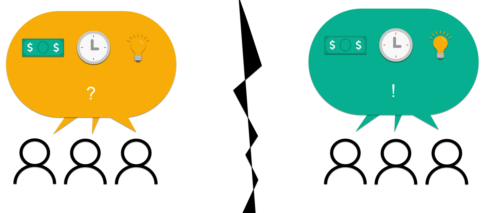
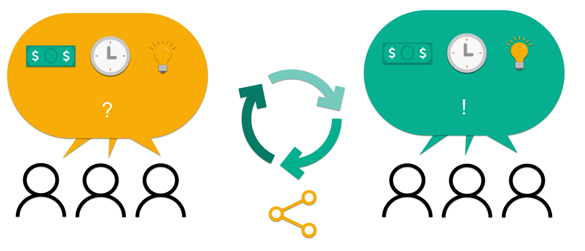

# Giver
Proyecto Web3 MVP marketplace ONGS y particulares [Pre-Incubadora Speezard]

#### Contexto del Proyecto: Pre-Incubadora Speezard. Cohort #2

Mayo a Julio 2023

Organizadores: [Speezard](https://www.speezard.io/)

Ubicación: Argentina

###### Participantes

* Franco Cerino | [ LinkedIn](https://www.linkedin.com/in/francocerino/)
* Benjamin Juarez | [ LinkedIn](https://www.linkedin.com/in/bj-pm/?locale=en_US)
* Federico Rascon | [ LinkedIn](https://www.linkedin.com/in/federas/) (Salió del Proyecto)

# One-liner

##### Versiones

* Queremos ser el marketplace de las causas sociales
* Queremos ser el canal por el cual las ONGs y las empresas conecten y aporten recursos para una causa

# Pitch

* [Presentación de 5 minutos: Pitch Day @Speezard](https://youtu.be/3MQvoXUPhuI?t=1303)

## Problema 

tl,dr Las ONGs luchan por recursos. Empresas y sociedad civil quieren aportar recursos pero no saben cómo, dónde

### ONGs y Fundaciones

Las ONGs y Fundaciones a las que entrevistamos coinciden en varios puntos: 

* Las ONGs, y sus líderes dedican una parte sustancial de esfuerzos a conseguir recursos.
* No tienen tiempo, o es escaso. La mayoría de las ONGs y Fundaciones están en estado naciente y se les dedica solo una dedicación laboral parcial. 
* No tienen plata, de manera que no pueden escalar sus esfuerzos.
* No tienen facilidad de gestión, normalmente una cabeza retiene toda la información de objetivos, necesidades, tareas a cumplir, y resulta trabajoso delegar responsabilidades
* Cuando los objetivos de ONG son poco claros o inexistentes, a los voluntarios les resulta poco estimulante aportar a la causa
* Las ONGs perduran con suma dificultad en el tiempo: o caducan o crecen. Su tiempo de vida promedio oscila entre los 3 y los 7 años, algunos sin personería jurídica, simplemente como organizaciones de la sociedad civil (OSC).

#### Punto de Dolor de las ONGs y Solución de Ciclo Virtuoso

Las ONGs solo tienen un tiempo escaso, y del cuál se pierde mucho buscando recursos. Entonces, si existiera una plataforma (como Giver) que les consiguiera los fondos y recursos, eso les permitiría hacer un uso más óptimo del tiempo porque solo lo dedicarían a coordinar a los voluntarios y hacer uso de lo donado. Una vez se consigan fondos y recursos, se pueden dar varios pasos positivos:

* Las cabezas de ONGs pueden estar más focalizadas en hacer lo que tienen que hacer: coordinar esfuerzos de los voluntarios
* Se definen objetivos y rumbo de la ONG
* Se crea entonces un círculo virtuoso: tanto los líderes de las ONG como los voluntarios ponen más en claro el objetivo y se sienten más motivados

### Empresas y Particulares

Los particulares son las personas que quieren aportar a causas y muchas veces las encuentran por conocidos, amigos y familia. Pero sobre todo, las personas aportantes a causas encuentran las causas a través de las redes sociales digitales, con plataformas que existen para compartir temas generales pero no están enfocadas en especial en causas sociales: como instagram, facebook, twitter, LinkedIn, TikTok, Discord.

Las empresas tienen algún nivel de contacto con las ONGs y Fundaciones cuando pueden asociarse de una manera estructurada, clara, programada, y donde los aportes no son solamente en especie, aportando objetos materiales y plata, sino además aportando voluntarios.

La dificultad de algunas empresas, en tiempos de crisis, es que no pueden aportar sostenidamente a las causas sociales que les interesan. (A veces apoyan una causa durante un tiempo y después quitan el apoyo.) También a las empresas a veces, como les pasa a las ONGs, les faltan recursos, también en tiempo y gestión, y plata. 

¿Esto implica que tanto empresas locales como ONGs locales pueden intentar buscar más conexiones con el exterior, donde quizás cada fondo valga más? Idea a validar.

#### Ejemplos de uniones entre Empresas, Particulares y ONGs

La sinergia que se puede lograr entre ambas partes es cuando la unión de cada lado producen resultados tangibles y de alto impacto. Un ejemplo de esto es cuando una organización internacional que creció desde LatinoAmérica ha sido Techo, que junta voluntarios de las empresas, con capital privado, y un aporte simbólico de los receptores beneficiarios, para construir una casa sencilla de madera para gente sin techo. 

El desafío de cualquier causa no es tanto resolver una meta concreta, porque cuando se arman por ejemplo colectas para algo específico, como puede ser auxiliar a un merendero o a un club de fútbol, mucha gente reacciona y aporta. 

La máxima meta a la que aspiran las ONGs es un apoyo continuado en el tiempo, de que la sociedad y las empresas no aporten simplemente una vez sino que pasen a formar parte de la institución y/o que aporten recursos de manera regular, por años, un año por vez.

Es importante destacar que nuestra propuesta no busca ser una solución simplemente de crowdfunding donde se dona a una causa por una única vez (aunque no rechacemos esto). Lo que buscamos es que se genere una relación entre las partes, de ser posible de manera continuada.

¿Cómo se pueden conectar las ONGs con los aportantes, sean particulares, o de empresas?

### Marketplace

No buscamos entonces simplemente ser una plataforma de crowdfunding, sino dar un especio donde los diferentes usuarios se pueden conocer los perfiles, y hacer match con las causas más significativas para cada parte. Cada interacción alimentaría cada perfil, un poco como Stack Overflow hace con medallas de reconocimiento a los que contribuyen ya sea con pedidos (preguntas) o con ofrecimientos (respuestas). 

¿Cómo encontrar las preguntas y respuestas, la oferta y la demanda para causas sociales?

Hay dos grandes grupos de gente que no logran encontrar lo que necesitan, y no hay ninguna plataforma dedicada a conectarlos, al menos no de manera masiva, o que sea usada por la gente que alcanzamos, tanto local como en el exterior.

Los dos grandes grupos de gente son:

1. Aportantes
2. Receptores 

Ambos grupos tienen muchos tipos de roles y personas, a veces se pueden superponer, es decir que no son excluyentes entre sí. Un mismo rol o persona puede ser aportante de una causa a la vez que receptor de beneficios. Ejemplo: Una ONG ambiental puede ser receptora de contribuciones de árboles donados por una empresa, o el estado, a la vez que es aportante de trabajo voluntario con horas de trabajo dedicada a la causa de germinar, plantar y cuidar árboles en barrios de su ciudad.

A modo de simplificación, vamos a decir que cada grupo tiene un cierto número roles.

#### #1 Aportantes

* Voluntarios de empresa, aportan tiempo y saber
* Particulares, aportan tiempo y saber
* Capitalistas, aportan plata, voluntarios y saber

#### #2 Receptores

* ONGs y Fundaciones, reciben todo a lo largo del tiempo
* Colectas, reciben para una causa puntual

## Solución

tl,dr Conectar ONGs con empresas y sociedad civil ayuda a las causas raíces que todos quieren construir

Queremos armar un producto mínimo viable (MVP) donde se cumpla un objetivo, conectar a los que quieren aportar con los que necesitan apoyo para una causa. Cada empresa ofrece un servicio esencial, entre oferta y demanda:

* LinkedIn > Trabajo
* Tinder > Match Personal
* Adplist > Mentorías
* Olio > Recursos Materiales, Comida
* Giverr > Causas Sociales

## Roadmap

* Validación del problema
* Validación de la solución
* Conseguir aportes de Empresas para ONGs, gestión manual
* Comunidad Mínima Viable
* MVP con código
	* Se ve oferta y demanda de perfiles en una landing page
	* La gente conecta a través de la página
	* La gente aporta y recibe a distintas causas. Se pueden mostrar el beneficio aportado con comprobantes, fotos, aceptación de ambas parte de envío y recibido, impacto en la blockchain, con UI/UX simple al usuario
	* Usuarios validan perfiles entre sí
	* Armado de colectas para una sola ocasión
	* Armado de aportes continuos en el tiempo hacia ONGs, compromisos anuales 
	* Establcimiento de gestión y metas entre las partes
* Constitución de figura financiero-legal tipo fideicomiso en la mecánica del rol, no necesariamente en el sentido legal institucional

## Monetización

* Freemium:
	* Recursos donados impactan en blockchain testnet, gratis
	* Plata: se cobra un porcentaje (1%?) por transacción
* Versión Premium: Horas de Soporte personalizado para auxiliar y definir gestión, planificación. 
* Update: Considerando si armamos el proyecto como non-profit

## Pitch Deck

* [Giver | Pitch Deck | 2023-07-03 ](https://www.canva.com/design/DAFnngpj46g/IpFyw25ixZ5Zl_ekYZh_cg/edit?utm_content=DAFnngpj46g&utm_campaign=designshare&utm_medium=link2&utm_source=sharebutton)

## Landing Page

* [Giver | Landing Page | Work in Progress](https://donaciones-giver.netlify.app/)

## Social Media

* [Twitter @giverdonations](https://twitter.com/giverdonations)

## Iteraciones anteriores

* [Hackaton Web 3 Think and Dev: Consorcios](https://github.com/lucianogarriga/hackaton-web3/tree/main)
* [Pre-Incubadora Speezard: Trazabalidad de Donaciones](https://docs.google.com/document/d/1HYXH7ikWdZynxOf6qeVRybxa-c2hF-aSnucDvBfs7Bk/edit)
* [Pre-Incubadora Speezard: Donations' Traceability, English Brief](docs/trust-pay--brief.pdf)
